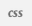

# Canvas Calendar Tweak

#### [About](#about) | [Comparison: Before and After](#comparison-before-and-after) | [Issues and Fixes](#issues-and-fixes) | [Install](#install)


### About
By default, the Canvas calendar doesn't look great. There are stylistic components that make it hard to tell which assignments have been turned in, and which assignments are still due.

This tweak modifies the CSS with the help of the chrome extension [Stylebot](https://chrome.google.com/webstore/detail/stylebot/oiaejidbmkiecgbjeifoejpgmdaleoha). After defining a style sheet, your Canvas calendar will no longer be frustratingly unhelpful, but will instead be the helpful tool that it should be!

### Comparison: Before and After


### Issues and Fixes

1) It is difficult to distinguish between incomplete assignments and submitted assignments.

     Fixes:

    - Incomplete assignments appear in red

        - On hover they appear bright red


    - Submitted assignments appear in grey

        - On hover they appear blue

        - On hover the strikethrough is removed

2) You usually can't read the full assignment name.

     Fixes:

    - Assignment logo removed

    - Assignment name wraps to next line (if needed)

3) If there are numerous assignments on the calendar throughout many days bottom weeks become hidden.

     Fixes:

    - Calendar now expands to whatever height it needs

    - Weeks collapse to only take up the vertical space needed to display their assignments

4) Other visual enhancements

    - Cursor changes to a pointer when hovering an assignment

    - The strikethrough on completed assignments is removed on hover

### Install
1. Install the chrome extension [Stylebot](https://chrome.google.com/webstore/detail/stylebot/oiaejidbmkiecgbjeifoejpgmdaleoha).

1. Click the Stylebot logo  in the upper right corner of the browser and select 'Options...'.

1. From the left hand nav bar, click 'Styles' and then click 'Add a new style...'.

1. For the URL, type `https://canvas.instructure.com/calendar`.

1. Copy the code from the [canvas-calendar-tweak.css](canvas-calendar-tweak.css) file, or just copy it from below:
```css
/*
CANVAS CALENDAR TWEAKS

Copyright (C) 2017 Robert Reed <https://github.com/RobertMcReed/>
Distributed under the MIT License.
*/

.calendar__event--completed, .fc-time {
    /*Dim the color of completed assignments and the time*/
    color: #857878;
}

a.assignment:hover .calendar__event--completed, a.assignment:hover .fc-time {
    /*Brighten the completed assignment and the time when hovered*/
    color: #0c8898;
    /*Remove the completed assignment strikethrough on hover*/
    text-decoration: none;
}

a.assignment {
    /*Make font redish by default*/
    color: #fc5555;
}

a.assignment:hover {
    /*make outstanding assignment text brighter on hover.*/
    color: red;
    /*Use a pointer on hover instedad of text cursor*/
    cursor: pointer;
}

.fc-content i[class*=icon-]:before, .fc-content i[class^=icon-]:before, .fc-content a[class*=icon-]:before, .fc-content a[class^=icon-]:before {
    /*remove the assignment icons*/
    display: none;
    margin-right: 0;
}

div.fc-day-grid div {
    /*Weeks are only as tall as is needed to fit the content*/
    min-height: auto;
    height: auto;
}

div.fc-day-grid-container, div.fc-scroller {
    /*Calendar is as tall as needed (no scoll needed)*/
    height: auto;
}

.fc-time[data-start="11:59"] {
    /*Fix the 11:59 submit time glitch*/
    margin-right: -5px;
}

/*TURN OFF ASSIGNMENT TIME (2 Steps)*/

.fc-time {
    /*(Step 1 of 2) Uncomment the display rule below to turn off assignment time*/
    /*display: none;*/
}

.fc-day-grid-event .fc-content {
    /*Show full title text*/
    white-space: inherit;
    /*(Step 2 of 2) Uncomment the display rule below to fix alignment of the title when time is off*/
    /*display: flex;*/
}
```
